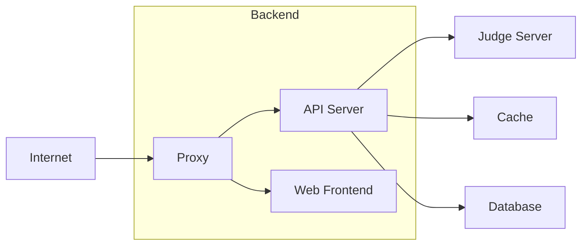

# Architecture

```mermaid

flowchart LR
  api["API Server"]
  static["Web Frontend"]
  judge["Judge Server"]

  Internet --> Proxy
  api --> judge
  api --> Cache
  api --> Database

  subgraph Backend
  Proxy --> api
  Proxy --> static
  end
```

## Tech Stack

### Proxy

Nginx

### Web Frontend

Vue + Element UI

### API Server

Django + Dramatiq

### Judge Server

Flask + seccomp
